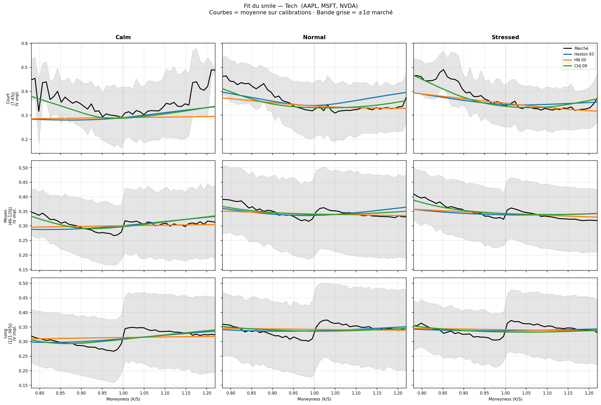
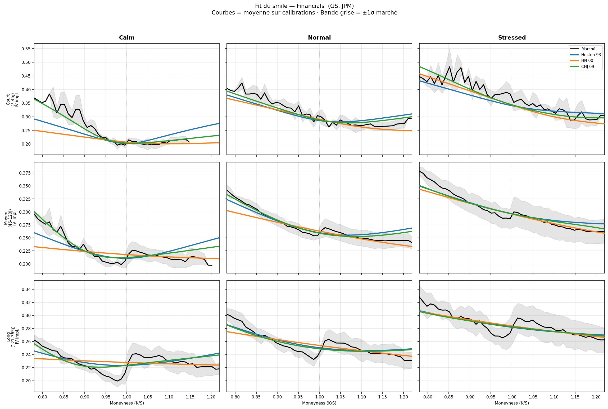
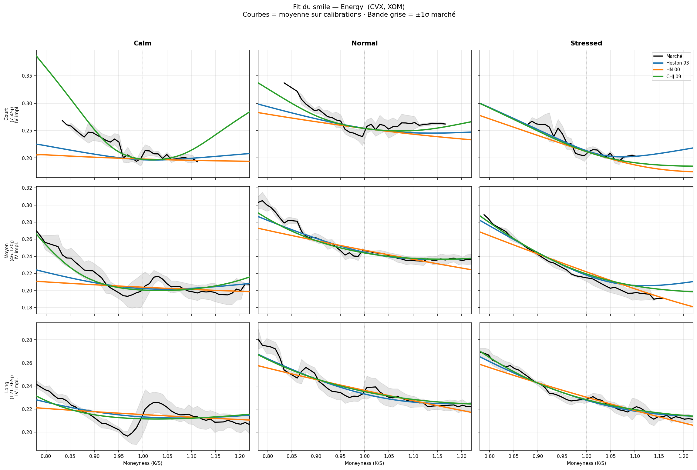

# Pricing d'options : Heston (1993), Heston-Nandi (2000) et Christoffersen-Heston-Jacobs (2009) sur données réelles

J'ai calibré trois modèles à volatilité stochastique sur des chaînes d'options de 10 actions du S&P 500 (données ThetaData), puis mesuré ce que valent encore les paramètres quand on les fige et qu'on re-price les chaînes observées 1, 3, 7 et 15 jours plus tard. Le test est répété dans trois régimes de volatilité repérés sur le VIX : juin 2024 (calme), octobre 2024 (normal) et avril 2025 (stressé, pic qui suit l'annonce des tarifs douaniers américains).

L'objectif n'est pas de désigner « le meilleur modèle » mais de quantifier un arbitrage classique : un modèle plus riche fitte mieux la surface du jour, mais est-ce que ça tient le lendemain ?

## Les trois modèles

Les trois partagent la même structure : une fonction caractéristique affine du log-prix sous la mesure risque-neutre,

```
φ(u, τ) = exp[ i·u·(log S₀ + r·τ) + A(τ, u) + B(τ, u)·V₀ ]
```

et le prix du call s'obtient par la formule d'inversion de Fourier de Heston (1993), évaluée par quadrature de Gauss-Legendre (64 nœuds). Changer de modèle revient à changer le calcul de A et B :

| Modèle | Origine de (A, B) | Variance d'état | Paramètres libres |
|---|---|---|---|
| Heston 1993 | Solution fermée des ODE de Riccati | V₀ scalaire | 5 |
| Heston-Nandi 2000 | Récursion discrète (journalière) | h_t, filtré depuis les returns puis recalibré | 6 |
| CHJ 2009 | Somme de deux facteurs Heston indépendants | (V₁, V₂) | 10 |

CHJ contient Heston comme cas particulier : il suffit d'éteindre le second facteur. Ça compte pour interpréter les résultats (voir plus bas).

## Données et calibration

- **Données** : chaînes d'options EOD (calls et puts) de AAPL, MSFT, NVDA, AMZN, PG, JPM, GS, CVX, XOM, UNH, groupées en 5 secteurs. Entre ~50 et 400 options par (ticker, jour) après filtrage.
- **Filtres** : bid > 0, mid ≥ 0.10 $, spread relatif ≤ 25 %, maturité 7 à 365 jours, moneyness 0.7 à 1.3, volume ≥ 1, mid ≥ valeur intrinsèque.
- **Loss** : RMSE sur volatilité implicite pondéré par le vega Black-Scholes (Christoffersen-Jacobs 2004).
- **Optimisation** : L-BFGS-B, reparamétrisation log des paramètres positifs, maxiter 700, multi-start avec 3 départs pour Heston et 7 pour HN et CHJ (on garde le meilleur).
- **Protocole** : pour chaque jour de calibration d, je calibre sur la chaîne du jour puis, paramètres figés, je price les chaînes de d+1, d+3, d+7 et d+15. Pour HN, la variance conditionnelle h_t est mise à jour via la récursion GARCH avec les returns réalisés (c'est le fonctionnement normal du modèle) ; les autres paramètres restent figés. Deux jours de calibration par mois de test, soit 6 dates par ticker.

### Régimes de volatilité

<p align="center">
  
</p>

VIX close (source ThetaData). Les bandes verticales sont les trois mois de test définis dans `config.yaml` ; les seuils calm < 15 et stressed > 25 sont arbitraires mais standards.

## Résultats

Vue d'ensemble en points de vol (RMSE sur volatilité implicite, moyenne sur tous les tickers et régimes) :

| | In-sample | J+1 | J+15 | Temps médian de calibration | Convergence |
|---|---|---|---|---|---|
| Heston 93 | 3.5 | 4.5 | 5.9 | 30 s | 83 % |
| HN 00 | 3.5 | 5.2 | **5.4** | 203 s | 100 % |
| CHJ 09 | **2.9** | **4.0** | 5.9 | 190 s | 63 % |

### Fit in-sample


CHJ fitte mieux presque partout, ce qui est attendu : les modèles sont emboîtés, un fit in-sample supérieur de CHJ ne prouve rien en soi. L'information utile est ailleurs : l'écart est modeste (~0.5 point de vol en moyenne), et les rares cas où Heston passe devant CHJ trahissent une calibration de CHJ coincée dans un minimum local (taux de convergence de 63 % seulement, malgré 7 départs).

### Fit du smile

Courbe noire = IV de marché moyenne (bande grise = ±1σ entre tickers et dates), courbes colorées = smile re-pricé par chaque modèle.

**Tech (AAPL, MSFT, NVDA)**


**Financials (GS, JPM)**


**Energy (CVX, XOM)**


Le défaut commun est net : aucun des trois modèles ne descend assez dans l'aile gauche des maturités courtes (puts OTM). C'est le crash risk implicite que la diffusion seule ne capture pas ; il faudrait un terme de sauts (Bates 1996). En Energy le smile est presque plat et les trois modèles s'en sortent bien. Les figures Consumer et Healthcare sont dans `results/figures/`.

### Dégradation hors-échantillon


C'est le cœur du projet. Trois constats :

1. **L'avantage de CHJ s'érode avec l'horizon.** Encore net à J+1, il a disparu à J+15 où les trois modèles se valent (5.4 à 5.9 points de vol). Signature classique du sur-ajustement d'un modèle riche recalibré chaque jour.
2. **HN est le plus stable à long horizon**, ce qui est cohérent avec sa construction : le filtre GARCH réinjecte l'information des returns réalisés, là où Heston et CHJ gardent un V₀ daté du jour de calibration.
3. **En régime stressé, rien ne tient.** Le RMSE IV passe de ~3.5 points in-sample à 15-18 points à J+3/J+7 en avril 2025 : la surface bouge trop vite pour des paramètres figés, quel que soit le modèle. HN limite un peu la casse.

### Synthèse


Meilleur modèle par (secteur, régime), mesuré hors-échantillon à J+1 — comparer in-sample avantagerait mécaniquement CHJ. CHJ gagne la majorité des cellules à J+1 ; sur les horizons plus longs le classement se resserre puis s'inverse au profit de HN.

## Ce que je retiens

- **CHJ tient sa promesse sur le fit** (le second facteur de variance aide vraiment sur la term structure) mais son avantage prédictif ne dépasse pas quelques jours, et sa calibration est fragile.
- **Heston offre le meilleur rapport qualité/coût** : 6 fois plus rapide, jamais très loin de CHJ.
- **HN est le seul dont l'état se met à jour sans recalibration**, et ça se voit à J+15. En contrepartie, son fit du jour est le moins bon et sa calibration est la plus lente.

## Limites

- 6 dates de calibration par ticker : assez pour dégager les ordres de grandeur, pas pour des tests statistiques sérieux entre modèles proches.
- Taux sans risque fixé à 0 et dividendes ignorés. Tous les modèles subissent le même biais donc la comparaison reste valable, mais les niveaux d'IV en sont légèrement faussés (les taux courts étaient ~4-5 % sur la période).
- Pas de sauts, d'où le biais systématique sur les puts OTM courts. Extension naturelle : Bates (1996).
- Calibration purement cross-sectionnelle (surface du jour). Christoffersen, Heston et Jacobs (2013) montrent qu'une calibration jointe options + returns est plus robuste, en particulier pour identifier les paramètres de la dynamique.
- Options américaines pricées comme européennes. L'effet est faible pour les calls sans dividende et les maturités courtes, moins négligeable pour les puts ITM.

## Reproduire

```bash
pip install -r requirements.txt

# 1. Placer les chaînes sous data/<TICKER>/<YYYY>/<MM>/<YYYY-MM-DD>_{call|put}.parquet
#    (données ThetaData, non incluses dans le repo)
# 2. Vérifier la couverture
python scripts/validate_data.py

# 3. Lancer le batch (reprenable : relancer reprend où il s'était arrêté)
python scripts/run_batch.py

# 4. Analyse
jupyter notebook notebooks/analysis.ipynb
```

Ajouter un ticker ou un secteur se fait dans `config.yaml` ; le batch et le notebook s'y adaptent.

```
src/
  models/         BasePricer (inversion de Fourier) + Heston / HN / CHJ + Black-Scholes
  preprocessing/  chargement des chaînes, filtres, IV vectorisée
  calibration/    losses + optimiseur multi-start
  analysis/       métriques, secteurs
scripts/
  validate_data.py, run_batch.py
notebooks/
  analysis.ipynb  (lit les parquets de results/, ne recalibre rien)
```

## Références

- Heston, S. L. (1993). *A closed-form solution for options with stochastic volatility with applications to bond and currency options.* Review of Financial Studies, 6(2), 327-343.
- Heston, S. L., & Nandi, S. (2000). *A closed-form GARCH option valuation model.* Review of Financial Studies, 13(3), 585-625.
- Christoffersen, P., Heston, S., & Jacobs, K. (2009). *The shape and term structure of the index option smirk: Why multifactor stochastic volatility models work so well.* Management Science, 55(12), 1914-1932.
- Christoffersen, P., & Jacobs, K. (2004). *The importance of the loss function in option valuation.* Journal of Financial Economics, 72(2), 291-318.
- Bates, D. S. (1996). *Jumps and stochastic volatility: Exchange rate processes implicit in Deutsche Mark options.* Review of Financial Studies, 9(1), 69-107.
