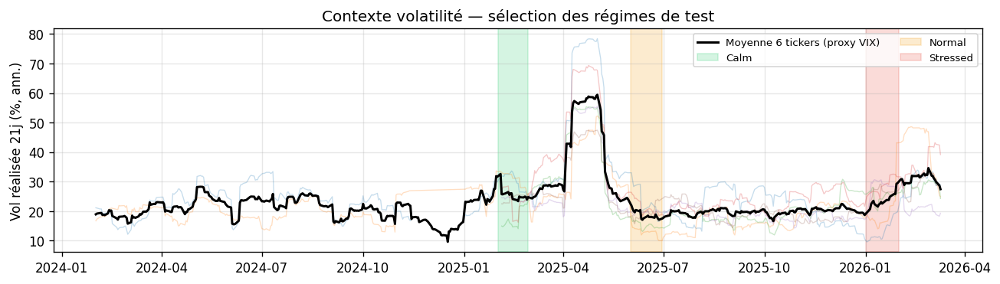
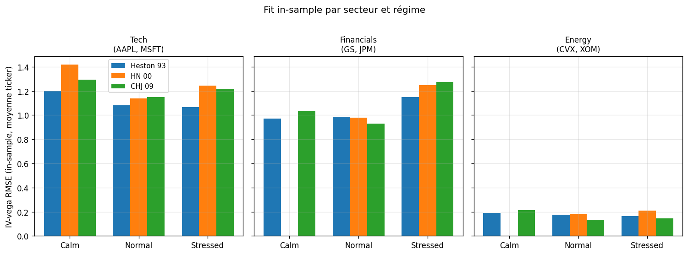
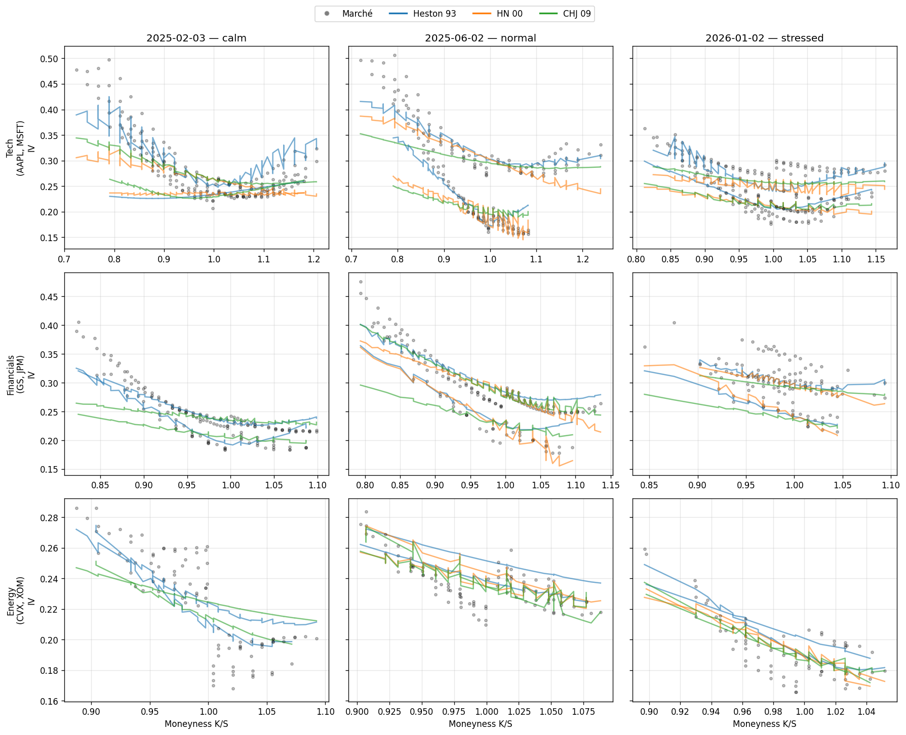
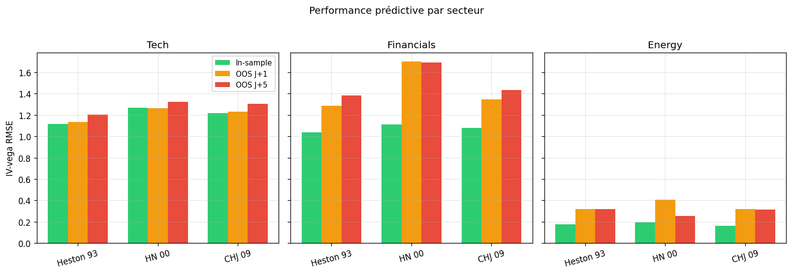
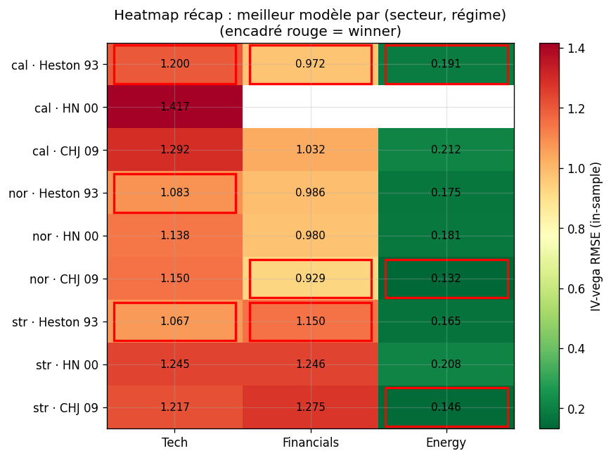

# Option Pricing — Comparaison empirique de Heston (1993), Heston-Nandi (2000) et Christoffersen-Heston-Jacobs (2009)

> Calibration cross-sectionnelle et backtest *rolling one-step-ahead* sur six actions du S&P 500 (trois secteurs), avec décomposition par régime de volatilité.

---

## Résumé

Trois modèles à fonction caractéristique sont comparés sur des chaînes d'options réelles AAPL, MSFT, JPM, GS, CVX, XOM (sources : ThetaData). Pour chaque jour de calibration, on extrait les paramètres optimaux en minimisant un RMSE pondéré par vega sur la volatilité implicite, puis on évalue la stabilité du pricing 1, 2 et 5 jours plus tard. Les six tickers sont groupés en trois secteurs (Tech, Financials, Energy), eux-mêmes croisés à trois régimes de volatilité (calm, normal, stressed) classifiés via la volatilité réalisée 21j du SPY.

---

## Méthodologie

### Cadre commun aux trois modèles

Les trois modèles partagent la structure affine de la fonction caractéristique du log-prix sous la mesure risque-neutre :

```
φ(u, τ) = exp[ i·u·(log S₀ + r·τ) + A(τ, u) + B(τ, u)·V₀ ]
```

Le prix d'un call s'en déduit par inversion de Fourier (formule de Heston 1993, intégrale de `quad` numérique). On change de modèle = on change la façon de calculer A et B :

| Modèle | Origine de (A, B) | État | # params |
|---|---|---|---|
| Heston 1993 | Solution close des Riccati ODE | V₀ scalaire | 5 |
| Heston-Nandi 2000 | Récursion discrète backward | h_t scalaire **filtré** depuis returns | 6 |
| CHJ 2009 | Somme de deux Heston indépendants | (V₁, V₂) | 10 |

### Calibration

- **Loss** : RMSE pondéré par vega Black-Scholes sur la volatilité implicite (standard Christoffersen-Jacobs 2004).
- **Optimiseur** : L-BFGS-B avec reparamétrisation log sur les paramètres positifs, `maxiter=500`.
- **Multi-start** : 2/3/5 points initiaux pour Heston/HN/CHJ respectivement, on garde le meilleur. Atténue le risque de minima locaux.
- **Filtres options** : bid > 0, mid ≥ 0.10, spread relatif ≤ 25 %, DTE ∈ [7, 365], moneyness ∈ [0.7, 1.3], volume ≥ 1, mid ≥ valeur intrinsèque.

### Protocole *rolling one-step-ahead*

Pour chaque jour `d` du calendrier de test :
1. Calibrer le modèle sur les ~300-400 options observées à `d`. → paramètres θ.
2. Avec θ figé, pricer les options observées à `d + 1`, `d + 2`, `d + 5`. → erreurs out-of-sample.
3. Pour HN, mettre à jour `h_t` via la récursion GARCH sur les returns observés entre `d` et `d + k`.

Les jours `d` sont choisis dans trois mois représentant trois régimes de volatilité, deux jours par mois.

### Sélection des régimes

<p align="center">
  
</p>

Vol réalisée 21j moyenne des 6 tickers, proxy de la VIX. Les bandes
verticales correspondent aux trois mois de test sélectionnés dans
`config.yaml` :

- **Calm** (vert) — février 2025
- **Normal** (orange) — juin 2025
- **Stressed** (rouge) — janvier 2026

Le choix est fait à l'œil sur cette courbe ; un mode `auto_classify_regime_via: SPY`
permet de reclassifier automatiquement via la vol réalisée du SPY.

---

## Résultats

### 1. Qualité du fit in-sample par secteur



Pour chaque secteur on moyenne le RMSE-IV in-sample sur les tickers et jours de calibration. Heston domine en Tech ; CHJ et Heston se partagent Financials et Energy.

### 2. Fit du smile de volatilité



Grille secteur × régime. Points noirs = IV de marché ; courbes colorées = IV reproduites par chaque modèle calibré. Les modèles SV continus tendent à sous-estimer les puts OTM sur Tech et Financials — signal classique d'un crash risk implicite que ces modèles ne capturent pas (motivation pour un modèle SVJ type Bates 1996).

### 3. Performance prédictive



Comparaison in-sample / OOS J+1 / OOS J+5 par modèle et par secteur. L'écart in-sample → OOS mesure le surfit : si la loss explose à J+1, c'est que les paramètres calibrés collent au panel d'aujourd'hui mais ne généralisent pas.

### 4. Vue de synthèse



Heatmap (régime × modèle) × secteur. Vert = meilleur fit, encadré rouge = meilleur modèle dans chaque cellule (secteur, régime). Heston gagne la majorité des cellules ; CHJ s'impose sur les régimes/secteurs où la term structure compte le plus.

---

## Structure du projet

```
src/
  models/         BasePricer + Heston/HN/CHJ + Black-Scholes
  preprocessing/  chargement multi-ticker, 7 filtres options, IV vectorisée
  calibration/    optimiseur polymorphe (loss + multi-start)
  analysis/       métriques, plots, mapping sectoriel data-driven

scripts/
  validate_data.py   pre-flight check disponibilité données
  run_batch.py       batch reprenable (in-sample + OOS rolling)

notebooks/
  analysis.ipynb     rapport pré-calculé (lit results/*.parquet)

config.yaml          tickers, dates, secteurs, régimes, horizons OOS
results/figures/     PNG exportés par le notebook (utilisés ci-dessus)
```

---

## Reproduction

```bash
pip install -r requirements.txt

# 1. Placer les chaînes options sous data/<TICKER>/<YYYY>/<MM>/<YYYY-MM-DD>_{call|put}.parquet
# 2. Vérifier la couverture
python scripts/validate_data.py

# 3. Batch (resumable)
python scripts/run_batch.py

# 4. Rapport
jupyter notebook notebooks/analysis.ipynb
```

Ajouter un secteur ou un ticker se fait dans `config.yaml` uniquement — le pipeline et le notebook s'adaptent automatiquement.

---

## Limites et extensions

- **6 tickers, 6 jours par ticker.** Statistiquement modeste — convient à une vitrine, pas à des conclusions définitives.
- **Aucun jump** dans les trois modèles → biais systématique sur les puts OTM courte maturité. Extension naturelle : Bates 1996 (SV + Poisson jumps).
- **Calibration purement cross-sectionnelle.** Pour HN, on filtre `h_t` depuis l'historique de returns, mais les autres paramètres sont identifiés via la surface d'options du jour. Christoffersen-Heston-Jacobs (2013) proposent une calibration jointe options + returns plus robuste.

---

## Références

- Heston, S. L. (1993). *A closed-form solution for options with stochastic volatility with applications to bond and currency options.* Review of Financial Studies, 6(2), 327-343.
- Heston, S. L., & Nandi, S. (2000). *A closed-form GARCH option valuation model.* Review of Financial Studies, 13(3), 585-625.
- Christoffersen, P., Heston, S., & Jacobs, K. (2009). *The shape and term structure of the index option smirk: Why multifactor stochastic volatility models work so well.* Management Science, 55(12), 1914-1932.
- Christoffersen, P., & Jacobs, K. (2004). *The importance of the loss function in option valuation.* Journal of Financial Economics, 72(2), 291-318.
